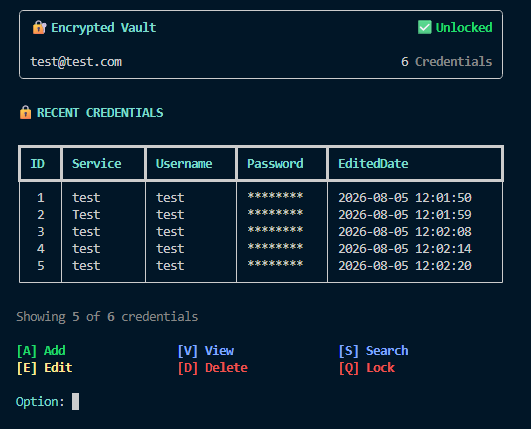
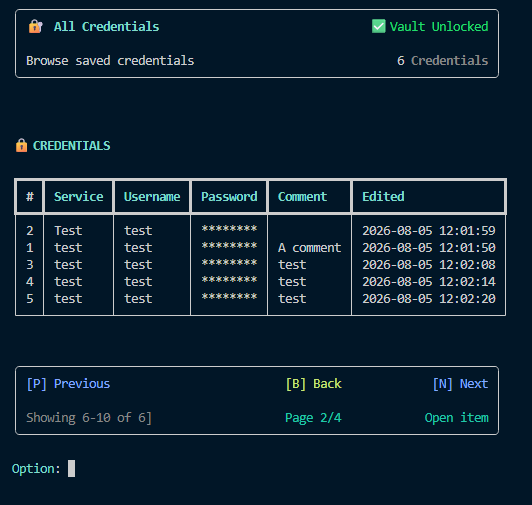

# Encrypted CLI Password Vault

A modular command-line password manager built with Python, SQLite, Argon2id, Fernet, Rich, and pytest.


> This project is under active development. It has not been independently security-audited and should not yet be used to store production credentials.

## Overview

Encrypted CLI Password Vault is a local password manager with a terminal interface. It supports user registration and login, encrypts credential passwords before writing them to SQLite, and separates interface, application logic, storage, validation, and cryptographic responsibilities into dedicated modules.

The project began as a way to learn Python by building a complete application rather than isolated exercises. The long-term goal is to evolve the same core domain into a REST API and web interface without discarding the CLI application.

## Current interface



The main interface displays an overview of five credentials stored in the vault. Users can navigate through the application by entering the key associated with the desired option.



The credential overview currently displays five records at a time, masks stored passwords, and orders records by service, username, and credential ID for predictable results.

## Current features

### Authentication

- Local user registration and login
- Email validation and duplicate-account prevention
- Master-password verification using Argon2id
- Separate salts for password verification and encryption-key derivation
- Per-user credential records

### Password vault

- Add credentials through an interactive CLI flow
- Encrypt credential passwords with Fernet before database storage
- Confirm entered data before saving
- Display a five-item recent-credentials overview
- Display credentials in a Rich table
- Sort credentials by service and username
- Mask passwords in overview screens
- Store creation and modification timestamps

### Application design

- Layered, modular project structure
- Separate interface, logic, service, storage, validation, and cryptography modules
- Custom application exceptions
- Automatic SQLite database and table initialization
- Parameterized SQL values
- Type hints across the application

### Testing

- pytest test suite
- Unit tests for cryptography, validation, login logic, vault logic, and storage logic
- Temporary SQLite databases through pytest's `tmp_path`
- Mocking and exception-path testing

## Development status

The CLI foundation is working, but the vault is not feature-complete.

### Implemented

- [x] Database initialization
- [x] Registration and login
- [x] Argon2id password verification
- [x] Session encryption-key derivation
- [x] Fernet encryption for stored credential passwords
- [x] Add Credential flow
- [x] Vault dashboard
- [x] Alphabetically sorted credential view
- [x] Five-record database queries for credential pages
- [x] Automated tests for the main application layers

### In progress

- [ ] Dynamic pagination metadata
- [ ] Previous and next page navigation
- [ ] Open an individual credential
- [ ] Decrypt a password only after an explicit user action

### Planned CLI features

- [ ] Search credentials
- [ ] Edit credentials
- [ ] Delete credentials
- [ ] Improved lock and session-key cleanup
- [ ] Export and import functionality
- [ ] Database migrations and schema versioning
- [ ] Packaging and release builds

### Future platform development

- [ ] FastAPI REST API
- [ ] Web interface
- [ ] PostgreSQL support
- [ ] Server-side multi-user authentication
- [ ] Docker deployment
- [ ] Cloud deployment

## Security model

The current implementation uses the following flow:

1. The master password is processed with Argon2id during registration.
2. A password verifier and separate random salts are stored in the login table.
3. After a successful login, an encryption key is derived for the active session.
4. Credential passwords are encrypted with Fernet before they are inserted into SQLite.
5. List views retrieve only the fields required for display and show a masked password value.

Security-sensitive code is still being reviewed and refactored as the project develops. A stable release will require additional testing, threat modelling, dependency review, secure key-lifecycle handling, and an independent security assessment.

## Project structure

```text
Encrypted-CLI-password-vault/
|
|-- src/
|   |-- interface/
|   |   |-- error_messages.py
|   |   |-- helper_functions.py
|   |   |-- login_interface.py
|   |   `-- vault_interface.py
|   |
|   |-- vault_services/
|   |   |-- add_items.py
|   |   `-- view_items.py
|   |
|   |-- crypto.py
|   |-- errors.py
|   |-- login_logic.py
|   |-- main.py
|   |-- main_logic.py
|   |-- storage.py
|   |-- storage_logic.py
|   |-- validator.py
|   `-- vault_logic.py
|
|-- tests/
|   |-- crypto/
|   |-- login_logic/
|   |-- storage/
|   |-- storage_logic/
|   |-- validator/
|   `-- vault_logic/
|
|-- pytest.ini
|-- requirements.txt
`-- README.md
```

## Technology stack

| Technology | Purpose |
|---|---|
| Python 3.14 | Application runtime |
| SQLite | Local persistent storage |
| cryptography | Argon2id key derivation and Fernet encryption |
| Rich | Terminal layout, panels, tables, and prompts |
| InquirerPy | Interactive input validation |
| pytest | Automated testing |

## Installation

Python 3.14 is currently required.

```bash
git clone https://github.com/Timeless101/Encrypted-CLI-password-vault.git
cd Encrypted-CLI-password-vault
python -m pip install -r requirements.txt
```

Run the application from the repository root:

```bash
python -m src.main
```

The SQLite database is created automatically on first start and is excluded from Git.

## Running the tests

Run the complete test suite:

```bash
python -m pytest
```

Run tests with detailed output:

```bash
python -m pytest -vv
```

Run one test file while showing printed output:

```bash
python -m pytest -s tests/storage/test_search_for_view_items.py
```

## Design goals

This project is being developed around a few practical goals:

- Keep user-interface code separate from business and storage logic.
- Make security-sensitive operations explicit and testable.
- Keep database access replaceable so SQLite can later be exchanged for PostgreSQL.
- Reuse the application and domain logic when the API and web interface are introduced.
- Prefer understandable code and incremental refactoring over prematurely complex abstractions.

## Contributing

Feedback, bug reports, security observations, and architecture discussions are welcome. Because this is also a learning project, please open an issue before submitting a large change so the reasoning and design can be discussed first.

Do not include real credentials, database files, encryption keys, or other secrets in issues, logs, screenshots, or pull requests.

## License

This repository does not currently include an open-source license. A license will be selected before the first stable public release.

## Author

**Diego Wuck**

System Engineer building practical Python and cloud engineering skills through hands-on projects.
